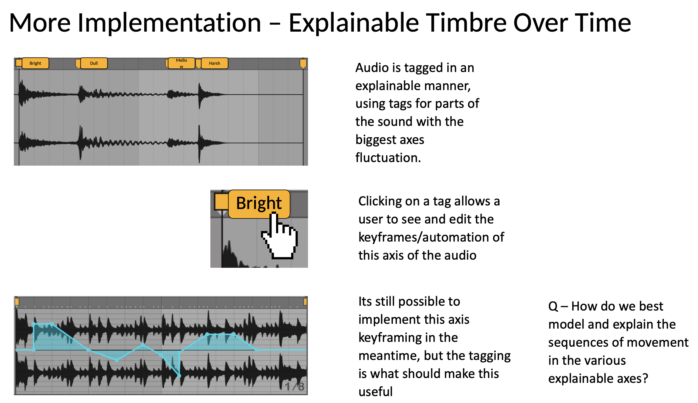
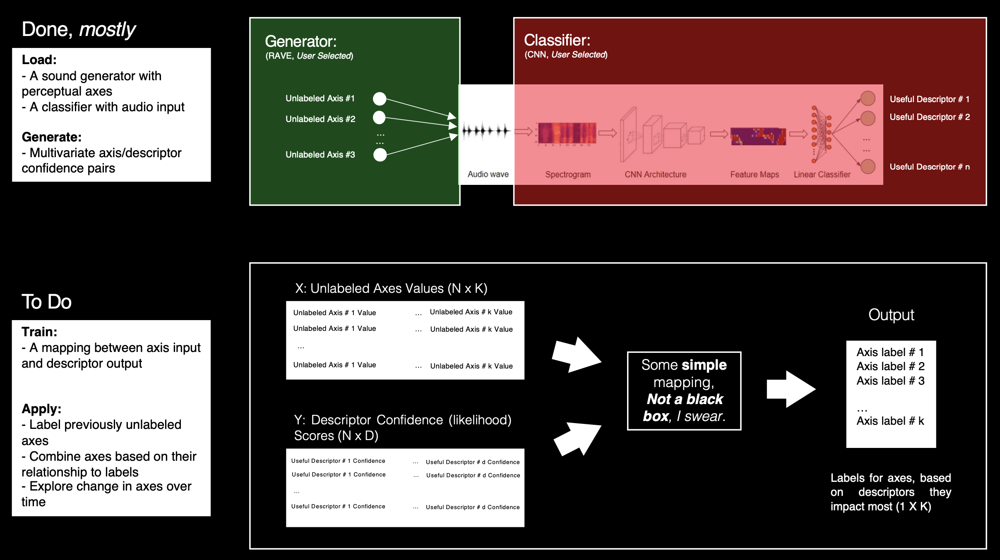

---
bibliography:
- references.bib
link-citations: true
---

# My PhD – "Latent Spaces for Human-Computer Music Generation"

Artificial Intelligence (AI) is increasingly applied in creative fields for the solution of problems (complex mappings in NIMEs, sonification) as well as the creation of artefacts (generate new musical ideas, re-arrange existing material). However, the tools used for training and implementation of such AI systems are often predicated on universalist design principles and large, pre-trained models, alienating end-users from their own data and its utility. 
<!-- For developers, this is primarily due to a poor understanding of the typical workflows of end users. Similarly, users face barriers due to generally low machine learning literacy, as well as a lack of model parameters/explanations exposed to them. This paradigm magnifies global inequalities in the digital sphere. -->

I intend to look at whether a shift in how we design, evaluate, and implement explainable and interactive (as well as interactive explanation and explainable interaction) generative systems can result in richer, more meaningful interaction for people making sound. In particular, I am examining the use-case of user-defined latent spaces for sample-based music generation. I consider sample-based composition not only as a domain to be technically supported, but as a prototypical example of reflexive interaction with data-driven musical systems.

<!-- I will explore a combination of  paradigms. This will be evaluated and iterated upon through the participatory design and evaluation of tools for sample-based music making. -->

# So far...

## Modules

Exploring the topics of the above project during my first-year classes, I:
- Made a physical interface for programming euclidean rhythms in real-time
- Trained a large language model on scraped data to describe imaginary synth patches
- Made an active learning model which classifies musical emotion in a semi-supervised fashion
- Designed a number of studies for evaluating human interactions in tech-mediated situations

## Research

As well as modules, I also undertook a number of research tasks in anticipation of my stage 0 review. These included:
- A literature review of explainable AI methods, and their evaluation, largely informed by [@bryan-kinns_exploring_2021] and [@a.SystematicReviewExplainable2023]
- Technical investigation into methods of explanation of symbolic music models models based on VAE and RNN architechtures, such as regularisation [@pati_attribute-based_2020] or interactive [@fiebrink_wekinator_2010] and small data approaches [@vigliensoniRVAELiveLatent]
- Autoethnographic exploration of these tools within the compositional practices of algorithmic composition and a punk band (separately, for the sake of anyone with hearing intact).

From these, I identified a lack of robust literature on creating and evaluating explanations in the context of music. A particular shortcoming in the analysis of [@bryan-kinns_exploring_2021] is the modelling of **grounding** without the reflexivity parameterised in [@clark_grounding_1991], where it was originally defined. I ruled out a one-size-fits all approach to designing explanations. I also swore against symbolic models, due to their rooting in the homogenised landscape of western classical and art musics (a reflection of the datasets available, and people willing to collect or work on them) [@gioti_artificial_2021].

I started working with RAVE [@caillon_rave_2021] and other generative neural audio systems. These systems use a neural network to learn a lower dimensional, latent space representing timbral fragments of a sound. Sound can then be generated by plotting paths through this space. There is lots of potential for generating, modulating and retrieving sounds using the latent spaces of these models, but they are currently not explainable, as the axes are learned in an unsuppervised fashion, and therefore differ between models. I replicated a study from Vigliensoni and Fiebrink [@vigliensoni_interacting_2023] which introduced the interactive machine learning paradigm to the latent space. In this IML paradigm, users can explore the latent space and then create mappings from interesting points to lower dimensional controls. However, this has two shortcomings: 
1. The initial navigation of the latent space is made no more explainable by this method, since the meaning of each latent dimension is still not communicated
2. The learned mapping is not transferable, since each model differs drastically.

## Questions

Generally, I am interested in the iterative mediation people experience as they train and experience AI systems. Some questions I have right now are:
- What do explanations look like if we distinguish less between sound and music?
- In interactive machine learning paradigms, the roles of explanation, analysis and generation remain largely fixed. How do explanations impact interactivity in machine learning? Can explanations be altered interactively? Can we build low-fidelity personalised explanations? Conversely, can explanations be crowd-sourced?
- How does mono-modal and multimodal context impact explanations? Can we leverage haptics for explainable AI systems?
- Why explain? Do explanations 'improve' the user's experience? How do we measure that?

# Onwards

## Current Designs - Interacting with neural sound

- I am currently designing a system for manipulating the latent representation of pre-loaded sounds  (This is currently on pause while I work on the below)
- I am also designing a system which facilitates user-editable generation-explanation pairs. This system will load a chosen generative model, then use a chosen classifier to map between semantic descriptors and the axes most relevant to them. Currently I am exploring methods of multivariate analysis, but am unsure how to evaluate/compare the systems.

## Future Work

- I aim to complete a systematic literature review of explanation mechanisms/paradigms in audio/signal processing, in collaboration with Shuoyang Zheng.
- Having just received approval from the department, I am also recruiting for an interview study trying to understand the ways in which sample-based composers understand the process of sampling. Interesting collaborations with musicians in Nairobi and the 'Etudes for Live Electronics' project in Austria have already revealed some interesting patterns, such as the parallels between sample collection and data-set management. Can we design with these existing processes in mind?
- Once my technical exploration is done, I want to implement and evaluate these systems with workshops and participatory design. I am currently thinking hard about how to do this, so am very open to suggestions from the community!
- I am also keen to bring a more critical angle to this work. Though, I am confident this will emerge over the duration of the PhD. But again, any ideas, please let me know!
