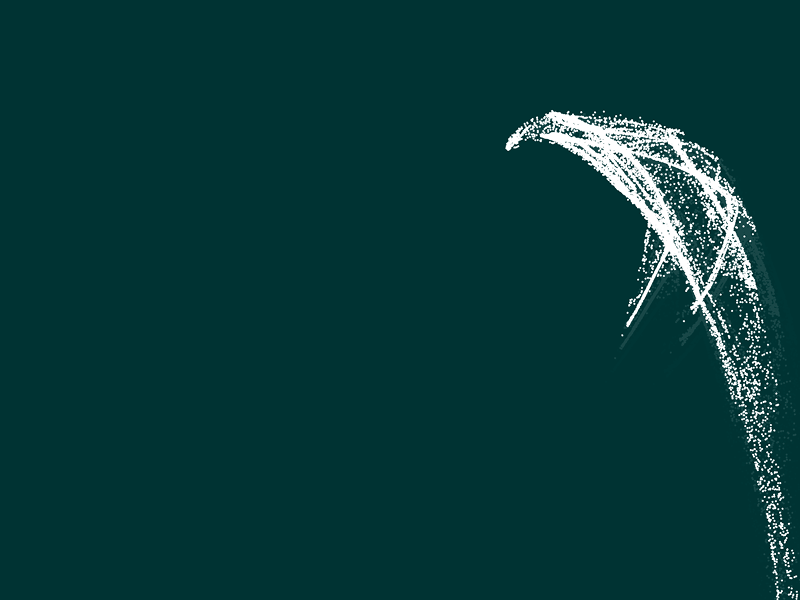
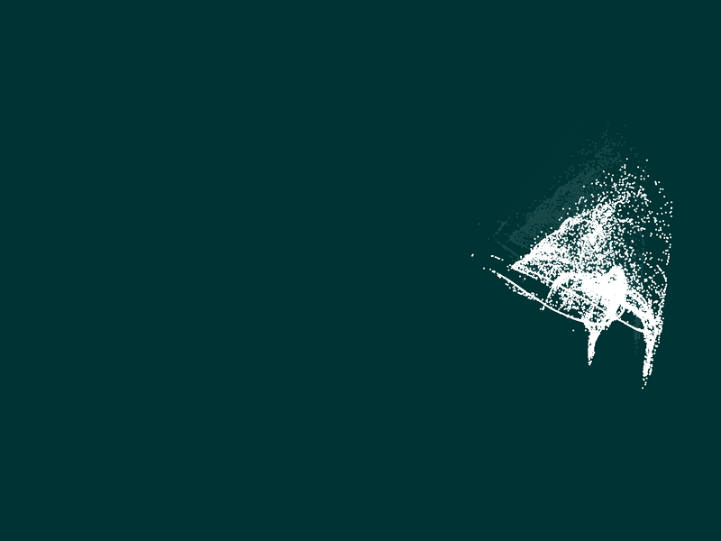
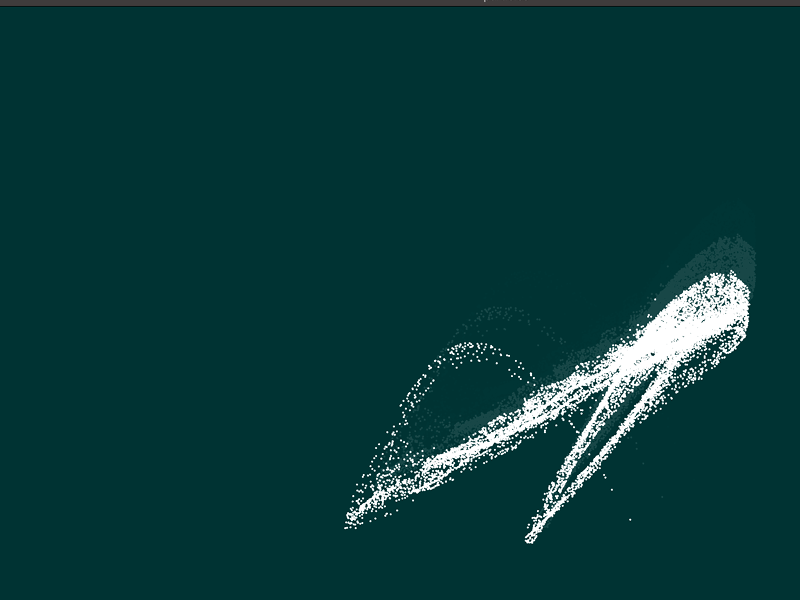
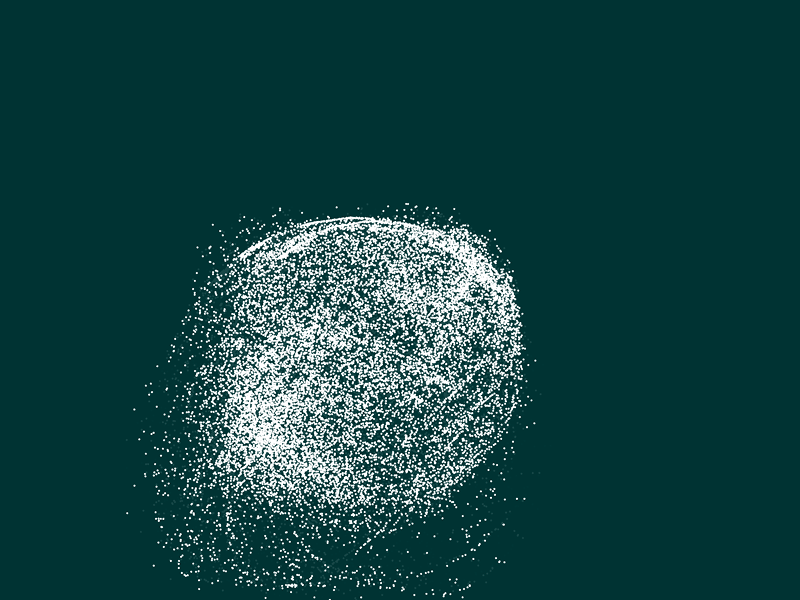

An exploration of digital site-specificity, this project places the user in a chaotically-deterministic loop. Since parameters change with each iteration, they must take time to figure out how the ecosystem works, and then sensitively compose with it, rather than into it. I see this as engaging with the intersection of instrument design with theories of sound ecologies. I am also using some machine learning and controller mapping to achieve this.

<!-- Embed soundcloud player: -->
<iframe width="100%" height="166" scrolling="no" frameborder="no" allow="autoplay" src="https://w.soundcloud.com/player/?url=https%3A//api.soundcloud.com/tracks/1111733245&color=%23ff5500&auto_play=false&hide_related=false&show_comments=true&show_user=true&show_reposts=false&show_teaser=true"></iframe>
<a href="https://soundcloud.com/ashnotketchup" title="Ashnotketchup" target="_blank" style="color: #cccccc; text-decoration: none;">Ashnotketchup</a> · <a href="https://soundcloud.com/ashnotketchup/gfm-ep1-guitar-and-voice" title="GFM Ep1 Guitar And Voice" target="_blank" style="color: #cccccc; text-decoration: none;">GFM Ep1 Guitar And Voice</a>

<!-- add link to grain fm -->
This project marks the second in my series “Grain FM”, an exploration of physical modelling and granular sampling/synthesis. In this particular manifestation, transients are mapped equidistantly about the unit circle, and then granularly sampled as controlled by weather data and gyroscopic controls.

<!-- 
<!-- 
 -->
<!-- 

<figure class="is-left gallery-figure column is-4 has-text-left-desktop">

 -->

<!--   -->
<!-- 
 
 
 
 -->

</figure>

<!-- -->

<!-- TODO:Basically I want images to share the width, while being the same height, or on mobile to take the full width

Convert this to parse just markdown images, this is too verbose 
 -->

<figure class="is-image mx-0 my-4">

    

        
        

    

        
        

    

    
  

  <figcaption class="my-0"> ↑ One-thousand particles are distributed about the unit circle. Users can control grain playback by manipulating this visualisation</figcaption>
</figure>

 
Here is a brief demo utilising a piano and the circle of fifths:
<iframe width="560" height="315" src="https://www.youtube-nocookie.com/embed/u7vPjRdDeAU?si=AyHCAZIPrei4nxW_&amp;controls=0" title="YouTube video player" frameborder="0" allow="accelerometer; autoplay; clipboard-write; encrypted-media; gyroscope; picture-in-picture; web-share" allowfullscreen></iframe>

<!-- does this work -->
[Download the patch + notes](ParticleGranulator_Stereo.zip)

