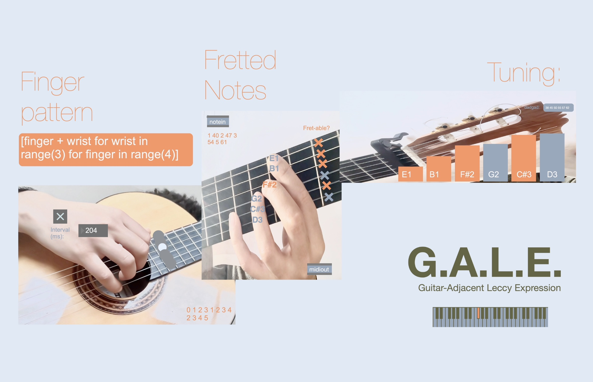
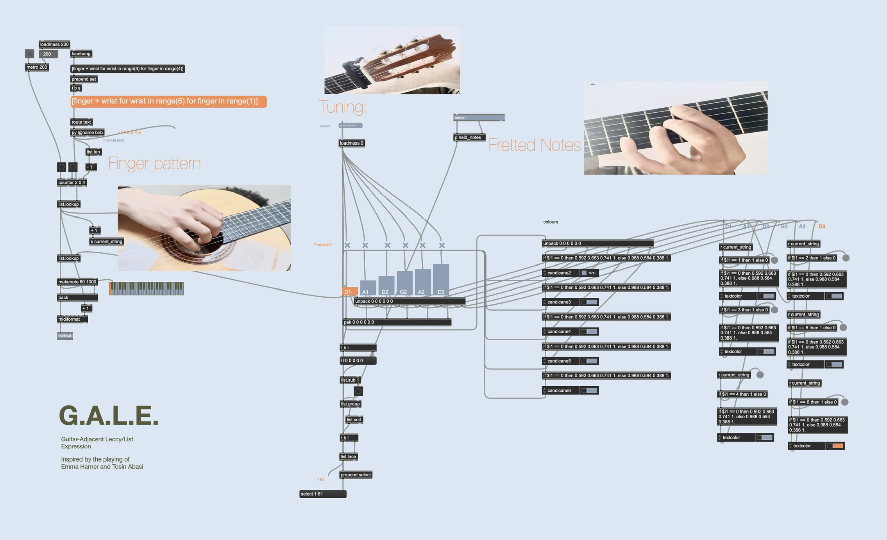

# Guitar as Sequencer
Recently, I've been exploring the potential of treating the guitar as a kind of sequencer: using the left hand to pre-program notes, and the right hand to sequence them. 

## Gale (Emma Harner)

The tune 'Gale' by Emma Harner is a good example of what I mean. The full track seems to be unreleased, but there's a snippet of it in her 'guitar moves' interview:

<iframe width="760" height="415" src="https://www.youtube-nocookie.com/embed/z4TBhZe_yXQ?si=_P-GvfKIpsOLD4Di&amp;start=1068" title="YouTube video player" frameborder="0" allow="accelerometer; autoplay; clipboard-write; encrypted-media; gyroscope; picture-in-picture; web-share" referrerpolicy="strict-origin-when-cross-origin" allowfullscreen></iframe>

Emma uses a combination of delicate open chords and complex right-hand picking patterns to create a rich, shimmering texture on the guitar. First I'll break down the parts, then I'll show how I made a Max for Live patch to emulate the technique.

### left hand

This tune takes full advantage of DADGAD tuning, leaving very little to do for the left hand:

``` text
Chords:
                Dmaj7(add11)        E7sus2(add4)         Gmaj(add9)
D (1st) |---------0--------------------0----------------------0----
A (2nd) |---------4--------------------4----------------------7----
G (3rd) |---------0--------------------0----------------------0----
D (4th) |---------4--------------------4----------------------7----
A (5th) |---------0--------------------2----------------------5----
D (6th) |---------0--------------------2----------------------5----
```

### right hand
The right hand is much more complicated. In this case, you pluck one finger at a time, then move your anchor position up by one, until you get to the top where you then do the entire thing in reverse. 

<!-- // Picking pattern (ascending anchor then descending)
// strings: 1=D (high), 2=A, 3=G, 4=D, 5=A, 6=D (low)
// pattern up:   6 5 4 3 | 5 4 3 2 | 4 3 2 1
// pattern down: 1 2 3 4 | 2 3 4 5 | 3 4 5 6 -->

```text


Ascending:
D|----|----|---x
A|----|---x|--x-
G|---x|--x-|-x--
D|--x-|-x--|x---
A|-x--|x---|----
D|x---|----|----

Descending:
D|x---|----|----
A|-x--|x---|----
G|--x-|-x--|x---
D|---x|--x-|-x--
A|----|---x|--x-
D|----|----|---x
```
First of all, I think 'high E = 6th' string is silly. I prefer to zero-index from the lowest string up. With that in mind, the ascending pattern becomes:

```
[0,1,2,3, 1,2,3,4, 2,3,4,5]
```
which is basically "use all the fingers, then move the anchor and repeat". This can be quite neatly put as a list comprehension in python:

```python
[ fingers + anchor for anchor in range(num_strings - num_fingers + 1) for fingers in range(num_fingers) ]

```
When num_fingers = 4 and num_strings = 6, this becomes:
```python
[ finger + anchor for anchor in range(3) for finger in range(4) ]      
```

Then we just travel backwards for the descending part.

<!-- (It’s also in Animals as Leaders’ ‘Apeirophobia’, but thats way harder to acronymise) -->

### the patch
I came up with this little patch in the process. I called it GALE:
Guitar-Adjacent 
(e)Lectronic 
Expression 
(or Guitar Automation via List Expansion). 



You can choose the pitch of open strings in the interface, then fret the rest via MIDI[^1]. The picking pattern is generated from the list comprehension [^2] sent into a python object. The right hand speed is controlled by a little metro object. Finally, each “string” is then routed to its own MIDI channel in Ableton, for per-string monophony and panning. It'd be interesting to map each finger to velocity too (eg, a thumb plucks heavier than a ring finger), but I haven't done that yet.

<iframe width="760" height="415" src="https://www.youtube.com/embed/-9AaNTUsrIs?si=st-A1QMwkDExJunE" title="YouTube video player" frameborder="0" allow="accelerometer; autoplay; clipboard-write; encrypted-media; gyroscope; picture-in-picture; web-share" referrerpolicy="strict-origin-when-cross-origin" allowfullscreen></iframe>

The full patch can be found on <a href="https://github.com/ashNotKetchup/gale-4-max" target="_blank" rel="noopener noreferrer"> GitHub </a>





## Thoughts
I like the ‘picking-as-sequencing’ and 'open string + frets' ideas, for computer music which is inspired by the guitar, as well as guitar music which is inspired by algorithms. I reckon there is some potential to strike a nice balance between playability (using midi for fretted notes) and complexity (list comprehension can get gnarly verrrry quickly). I'll update this page with any revelations as I explore further!

<!-- Footnotes -->

[^1]: Midi notes are sorted by pitch, then assigned to strings that have been activated by the user (orange 'X' button) from the lowest string to the highest
[^2]: One could send any python function that outputs a list, the possibilities are endless!