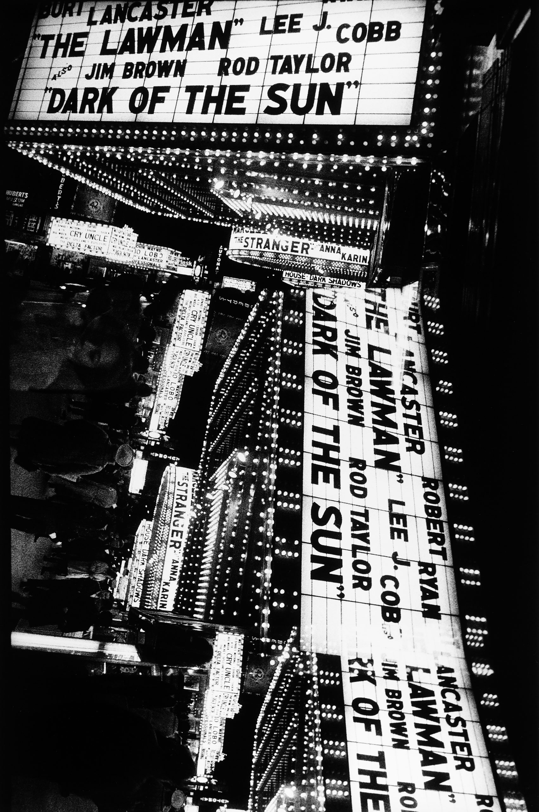

I'm currently obsessed with Daido Moriyama’s work with the half-frame camera[^1]. Leveraging one piece of film for two exposures contributes to an agressive, pushed look. But for me, the most interesting change is one from shot to –> sequence. 

<!-- caption: Untitled, New York, 1971. © the artist/Daido Moriyama Photo Foundation. Courtesy C/O Berlin -->
<!-- add examples here -->

By presenting two events at once, the viewer is forced to consider the temporal and spatial juxtaposition of subsequent images.

I thought it might be interesting to explore something similar with **stereo algorithmic music**[^TM]. Performing different contexts simultaneously, bringing them in and out of dialogue with one another, exploring their (inter)subjectivity, and questioning the absurdity of context itself.

Here are some ideas with two algorithms. 

<iframe width="560" height="315" src="https://www.youtube.com/embed/videoseries?si=c4QIdlwoJ9RHrSYP&amp;controls=0&amp;list=PLd82WwK7X-qy9S-x38Z4pV8HjAnK84eKg" title="YouTube video player" frameborder="0" allow="accelerometer; autoplay; clipboard-write; encrypted-media; gyroscope; picture-in-picture; web-share" referrerpolicy="strict-origin-when-cross-origin" allowfullscreen></iframe>

 Left is essentially <a href="https://www.instagram.com/p__meyer/" target="_blank">@p__meyer</a>‘s intra patch.   

 Right is a variant of that which I made to implement Bresenham’s line algorithm in real-time. 

  

They’re being fed the exact same information, and controlling two instances of an FM synth (operator). What’s fun is that they are inverted - as intra becomes denser, the bresenhamians become sparser. Also feeding their position in the bar to pitch, and modulating their time unit with sine waves. 

They’re sometimes consonant, sometimes dissonant. Always fun, in any case.

<!-- Visual Description: Each slide has three frames. A visualisation of the left hand signal, in grey and yellow, my hands on an ableton push, which lights up on some squares. Another visualisation. -->

[^1]: Particularly, his ’71-NY, 2002 series, which used the Olympus-Pen W. More on this [here](http://www.thislongcentury.com/andrew-roth?c=18).
<!-- [^TM]: -->