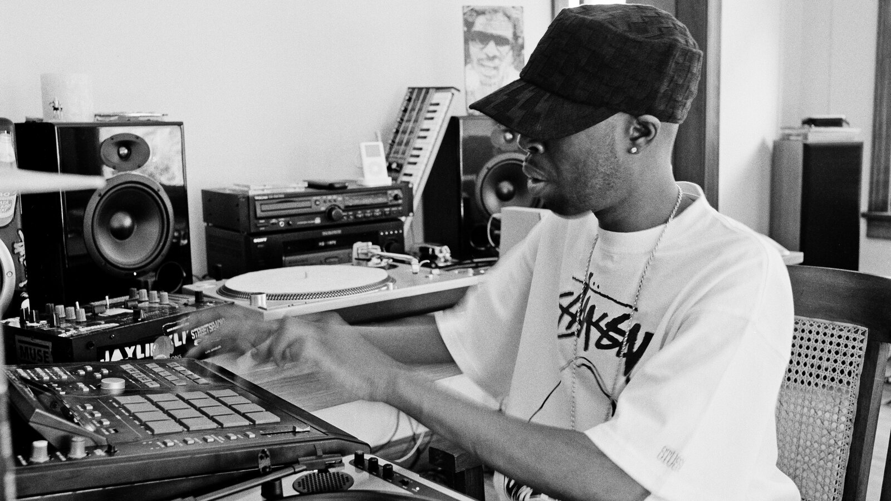
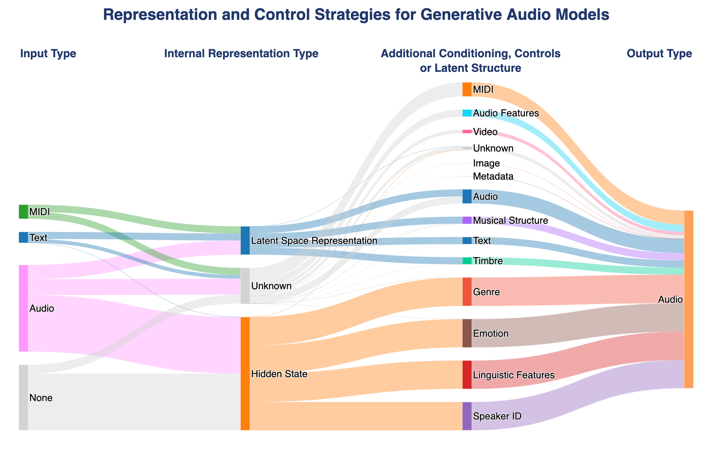

## tl;dr
Samples are more about context than content. AI systems will struggle to address the sample-based community as long as they prioritise the former.

## [Download the poster here](https://www.dropbox.com/scl/fi/ju982jr483jssm3awft6h/AIMS_Poster-1.pdf?rlkey=vbqgv8mvgng5iq2zvk3kb5knf&st=yjgmevh8&dl=0)
The full-res poster, as presented at AIMS '26, is available at [this link.](https://www.dropbox.com/scl/fi/ju982jr483jssm3awft6h/AIMS_Poster-1.pdf?rlkey=vbqgv8mvgng5iq2zvk3kb5knf&st=yjgmevh8&dl=) Below is a more fleshed out exploration of the themes of the poster.

## Code
Code and data used to create these diagrams are available at: https://github.com/ashNotKetchup/aims-2026-is-depth-real-figures

<!-- ## Longer document coming soon. Hold tight while we update this page -->

## Ayy Eye Jay Dee?

James Dewitt Yancey, J Dilla, or Jay Dee (1974-2006) was a pioneer in sample-based hip-hop music production. He took existing records, and spliced them into new compositions, often altering the meaning or feel of a piece in the process.

*(above: Dilla producing music on an Akai MPC (music production centre) in his studio)*
      
Why have we not seen an AI model which can analyse or replicate J Dilla’s music? More broadly, why is there no AI approach to sample-based music? Are AI tools useful for sample-based music-makers? Sure, there are AI tools for making new samples (see Infinite crate: <https://magenta.withgoogle.com/infinite-crate>, which can be used to create samples/musical ideas), and for manipulating audio with timbre transfer or stem separation, but none for manipulating samples proper (or at least manipulating samples of pre-existing music, taking into account the pre-existing-ness of the music being sampled, à la Walter Benjamin's necessarily technologically reproduced work of art). To the author's knowledge, there are no such tools for generating complete sample-based tracks (given a sample input). In much the same way that AI poetry struggles to engage the collective spirit, and that generative jazz systems rarely meaningfully interpolate + reference as players do, generative audio systems lack the reflexive and interpretive capacity for turning one record or more into a beat, also known as 'flipping' a sample.

<!-- cite cambridge samples guy -->

Ignoring for a moment whether or not anyone would want such a thing, it is interesting that sampling – a method of making music by reusing existing sounds, historically denigrated for being supposedly simple, lazy and easy – seems unaffected by the rise of new, highly automatable generative AI systems which also make music by reusing existing sounds.

 ## Samples Depend on Context

I suppose there are some reasons for this.

The first is the obvious one, copyright issues: generative AI systems prohibit the uploading of copyrighted material, and are often created with guardrails to prevent the accidental reproduction of input data in outputs. 

The second is that people (or at least the culture at large) don't seem to want such tools. Hip-hop producer Timbaland, who openly embraces new and often-AI-driven technologies in hip hop production, has been repeatedly shunned by the hip-hop community for this 'betrayal'. Producers who do use generative AI in their music tend not to disclose this, either to the public or to their lawyers.

The final and more fundamental issue is that of the current deracination of AI systems. That is to say that: AI systems and their data are increasingly divorced from their context — the context of each data point, of the larger dataset, and of the model itself — leaving it without a clear interpretive perspective or situatedness. I argue that this leaves AI systems ill-equipped to deal with the values and methods used in sample-based music making. While sample-based music deals largely in the realm of context, generative AI tools deal almost entirely in the realm of content.

  *(Above: J-Dilla's 'Stop!' when it is annotated w.r.t content vs context. The additional context turns it from a standard hip-hop track into a mournful victory lap for one of hip-hop's greats.)*
     

Consider, for example, the J Dilla Track 'Stop!' (2006). Shown in the figure above, a simple content-based analysis of the track can highlight the use of multiple audio sources, lyrics, the musical structure and timbral effect of the piece. Meanwhile, wider context reveals that Dilla himself may have been trying to relate to his own mortality on the track, since (A) *he* transformed the lyrics from ''it's that real shit'' to ''is death real?'' and (B) he was on his own deathbed while producing it.

For such a track, interpreting the sample depends at least 50% on context. Without that, an AI system will never be able to interpret it.

<!-- (Make it clear that we are talking about inter/intracultural sampling ie sampling from known sounds, rather than from sound libraries? (right?)) -->
<!-- 
s…but they still have no context….theyre nothing.Sampling isn’t about

sampling is a game of 50% context, and without that, AI systems will never be relevant. -->

 <!-- Why is this? Are they fundamentally incompatible? -->

### Context in Sample-based Music Communities

In our own study of values and practices in sample-based music communities (Noel-Hirst et al 2025), we found that context was extremely important for making sample-based music. We identified 4 aspects of sampling context relevant to GenAI:

- **Environment:** Artists engage with both physical and digital environments, referencing hometowns for nostalgia, or making commentaries about the dynamics of online spaces
- **Community & Identity:** Samples and techniques form part of artists’ identities, with knowledge shared through events like beat contests. Descriptions of sounds are dependent on the community context, including familiarity with the person to whom they are describing the sound.
- **Reality and fiction:** Artists really care about a sample’s provenance (connection to real events and contexts), even if the sample has since been heavily manipulated.
- **Agency:** A reflexive component. Artists view samples as both inert materials to sculpt and as dynamic elements to engage with. Communicating the role of a sample to audiences is an incredibly important part of this process.

<!-- (from script….)

higher-level provocations around  
provenance, social context, and intertextuality -->

### Perspectives on Context

The importance of samples’ context can be seen illustrated from two perspectives: Attempts to communicate, as drawn out in pragmatist linguistics and the concept of [utterances](#utterances); and as [boundary objects](#boundary-objects) of communal meaning making, such as in anthropology.

#### Utterances
Pragmatists in linguistics and philosophy of language distinguish between *sentences* and *utterances*. A sentence is a collection of clauses with propositional meaning, whereas an utterance is an *instance* of a sentence. What sets apart the interpretation of an utterance from a sentence is its context. Generative AI models have gotten good at handling sentences, but are still very poor at handling utterances. Applying this framework to the sample above, we might think of the musical content (including lyrics, genre information, etc) as making up the sentence of the sample, whereas the context in which it was created (or even in which it was heard) is the utterance. For some pragmatists, information is only communicated through utterances.

#### Boundary Objects
Samples can also be objects about which meaning coalesces. Anthropologists Star and Griesemer (1989) introduced the notion of a ‘boundary object’ to describe objects of knowledge exchange in heterogeneous communities. Such are objects are both adaptable to different viewpoints and robust enough to maintain identity across them. Recently, researcher and musician @sim_mtl applied this to soundsystem communities. In sample-based communities, we might consider samples also as boundary objects, sounds around which a range of meanings can be shared, made and reimagined. 

#### Caveat - Schaeffer’s Sampling

At this point, it is worth highlighting that the premiership of a sample's context is not shared universaly among sound practitioners and theorists. For example, Pierre Schaeffer and his contemporaries didn’t care about what we might call sampling! They claimed: ‘as long as signification is predominant […] we have literature and not music’. For Scaefffer, a sample is to be treated based on its qualities as a raw material, divorced from referential meaning. This perspective can be seen in the initial work of the GRM, as well as in much electroacoustic composition since (for example in the work of Xenakis, Roads, and Wishart). While that's all cool, that's not the stuff I'm talking about. By contrast, I'm talking about sampling in its intertextual mode – any approach which embraces cultural valence of sound, for example in its potential for reference and quotation. 
<!-- %% We distinguish four types of boundary objects: repositories, ideal types, coincident boundaries and standardized forms..  apply this to future analysis %% -->

## GenAI Manipulates Content

While sampling as we have discussed so far is concerned with context, the range of controls and representations in GenAI primarily relates to the content of an input sound.

The figure below shows the range of controls available to users who want to generate or manipulate audio with GenAI. User control is often facilitated through conditional generation, or latent space regularisation, and is supposed to increase interpretability and usability. The controls are almost entirely related to the content of the sample (e.g., using timbre space analogy (esling et al. 2018)). If the domain that these tools are used in is primarily contextual, how can content-driven controls increase their interpretability?

The lack of contextual awareness is important beyond generative tasks. Generative AI systems are more than mere effects pedals, they are used as part of larger systems, for example downstream classification and captioning tasks. My boss DS-1 distortion pedal is not being used for any of that.

*(Above: Representation and control strategies for generative audio models. Starting with an existing database of generative models created by Wilson et al. (2025), we added additional codes to categorise (1) the type of internal representation used in the model, and (2) the control available to the user, whether by additional conditioning, or enforced latent structure)*

### *(Definition - Semantic Mediation)*

Semantic mediation is the use of description to bridge between modes, for example allowing control of a model's output sound via some timbre description.

### What is Lost in Semantically-Mediated Sampling?

We want to better understand the role GenAI might play in sample-based music making.

We created a tool for dynamically creating latent controls for generative models based on timbre descriptors and raw audio features. By asking sample-based musicians to make music with such a tool, we hope to understand:

(A) If semantically-mediated models are helpful for sample-based music making (specifically: RQ1. How do different latent representation strategies impact sample-based musicians’ sense of a sample’s meaning? RQ2. How do different latent representation strategies impact sample-based musicians’ creativity and ability to manipulate a sound?)

(B) What they miss

(C) How the [four themes](#context-in-sample-based-music-communities) of context in sample-based communities are affected by control interfaces.

Can AI ever be compatible with sampling? Is this more or less likely with timbre/genre/etc... semantically-mediated interactions?

<!-- ## Intro: Why is there no AI J Dilla? (not that We want one) And why Does Everyone Hate Timbaland? (Or: AI J Dilla? No Thanks!)

Why is there no AI sample-based music? Not that we want it. Its just an interesting consideration. Sample-based music - once denigrated for its ‘simplicity, laziness and ease of production’ – seems unaffected by the rise of new, highly automatable generative AI systems.

![[URGENT! poster and print 2026-03-27 14.47.58.excalidraw.png|1]]

%%[[URGENT! poster and print 2026-03-27 14.47.58.excalidraw.md|🖋 Edit in Excalidraw]]%%

Sure, there are ai tools for making new samples (list a few), and for manipulating audio, but none for manipulating samples. And to the authors knowledge, there are none for generating complete sample-based tracks.

There are of course, generative ai systems (such as…. )that can be used to create hip-hop tracks, but in the same way that generative jazz systems rarely interpolate as players do (source), these generative systems lack the capacity for turning one record or more into a beat, also known as flipping a sample.

There are some reasons for this.

The first is the obvious one: copyright issues, generative ai systems prohibit the uploading of copyrighted material, and are often created with guardrails to prevent the accidental reproduction (whats the word?) of input data in outputs.

The second is that people don’t seem to want such tools…hip hop producer Timbaland, who openly embraces new technologies in hip hop production, is often ostracised by the hip hop community for (???)

the final, and more fundamental issue is that of the current deracination of AI systems. That is to say that: AI systems and their data are increasingly divorced from their context: the context of each data point, of the larger dataset, and of the model itself, leaving it without a clear interpretive perspective or situatedness @comp…hermeneutics

## Context

The importance of samples’ context can be seen illustrated from two perspectives: Attempts to communicate, as drawn out in pragmatist linguistics; and as objects of communal meaning making, such as in anthropology.

### Linguistic Theory and Utterance as it Relates to Samples

Just as one requires an understanding of classics and (what history is necessary for dante?) to interpret the references in dantes inferno, so too is knowledge of context required to understand musical samples.

Pragmatists in linguistics and philosophy of language distinguish between *sentences* and *utterances*. A sentence is a collection of clauses, and may.. whereas an utterance is an *instance* of a sentence. What sets apart the interpretation of an utterance from a sentence is its context.

It is much the same with interpreting musical samples.

compare dillas is death real sample with and without context ![[URGENT! poster and print 2026-03-27 15.56.49.excalidraw.png]]

%%[[URGENT! poster and print 2026-03-27 15.56.49.excalidraw.md|🖋 Edit in Excalidraw]]%%

### Boundary Objects and Samples

Samples are not just to be interpreted from the perspective of the utterer, but rather they can also be objects about which meaning coalesces.

Anthropologists @starInstitutionalEcologyTranslations1989 introduced the notion of a ‘boundary object’ to describe (definition). In much the same way as @sim applied this notion to soundsystems, the musical sample can be seen as a boundary object connecting….. ideals…. continue list.

![[Screenshot 2026-03-27 at 16.12.18.png]]

our own research has unearthed themes and values of…. @noel-hirst

## Content

Context is important for musical sampling, so important in fact, that sample-based databases such as whosampled are relational…

### Descriptions of Sound

Instead of an instance or utterance based approach to describing sounds, many models for describing and controlling sounds (eg timbre-spaces) deal with the content and not the content of sound.

(insert some chart or analysis of open source models from nick and anna w’s website… mode of control or something like that…)

### Our Study

We want to look at what do they capture? what do they miss?

how are they operationalised + can AI ever be compatible with sampling?

our approach, attribute regularisation and study design…. with Rqs. Revise them to match the actual content here pls…
-->

[^1]: Theory on utterance etc. existing work, And ethnography study.
[^2]: our empirical study 
